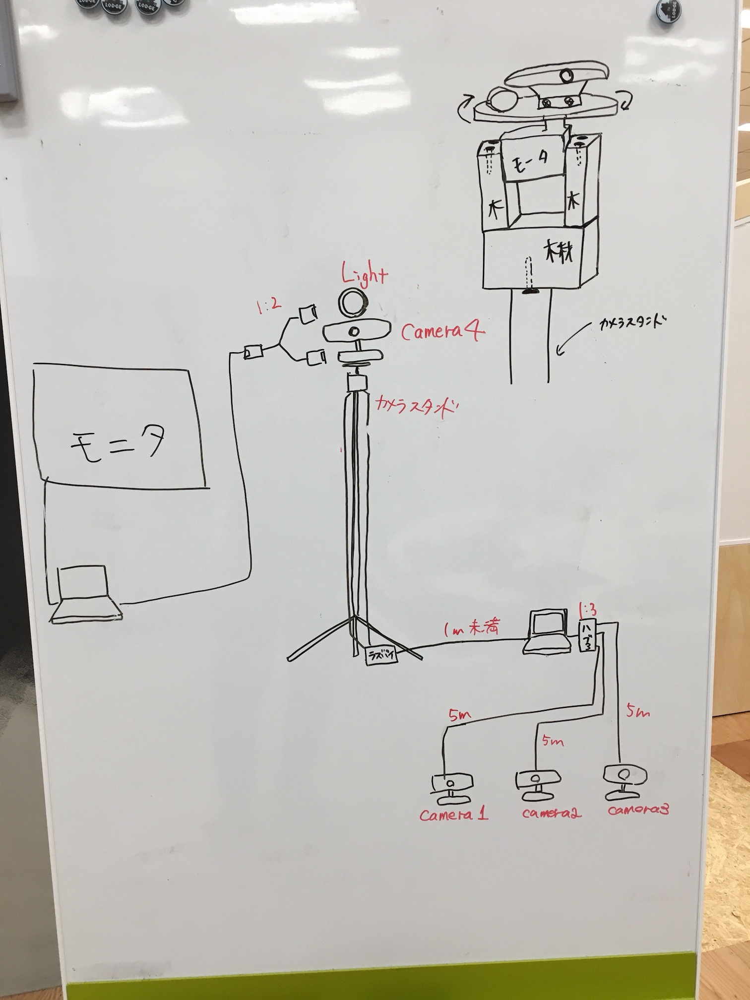

# 例の機械を作成

## 見た目の完成図

## 概要
- 数秒に一度、複数のセンサーから値を取得する(MAC側)
- センサーの位置は変数(配列)で保存可能, 値は角度で保存(MAC側)
- センサーの位置を向く(回転する)機能がある(Raspberry pi側)
  - 機能としては、信号を受け取ったら〇〇度回転するというものだけ
- 台を何度回転させたかを保存しておき、向きたいセンサを指定しただけで自動計算されるようにする(Mac側)

## dockerによる環境構築
- 最近dockerがスタンダードになる(らしい)ので勉強を兼ねて使ってみる
- とりあえず[Docker for Mac](https://docs.docker.com/engine/installation/mac/)を入れてみる
- Dockerfileのあるディレクトリに移動
- `docker pull centos`でcentosのイメージをダウンロードする(無かったら必要)
- `docker build -t {任意のイメージ名} .`でimageをビルド
- `docker run -it --name {任意のコンテナ名} {作成したイメージ名} /bin/bash`でコンテナを作成してbashログイン
- dockerの使い方は[よく使うdockerコマンド](http://qiita.com/noralife/items/18301143c20cc5172c56)とかで確認
    - `docker pull` : Docker Hubからイメージのダウンロード
    - `docker build` : Dockerfileからイメージの作成
    - `docker images` : Dockerイメージの一覧取得
    - `docker rmi` : Dockerイメージの削除
    - `docker ps` : Dockerコンテナの起動確認
    - `docker run` : DockerイメージからDockerコンテナの作成（と起動）
    - `docker start` : Dockerコンテナの起動
    - `docker exec` : Dockerコンテナ上の環境に対しコマンド実行
    - `docker cp` : Dockerコンテナへファイルコピー
    - `docker stop` : Dockerコンテナの停止
    - `docker rm` : Dockerコンテナの削除
    - `docker commit` : DockerコンテナのDockerイメージ化
    - `docker push` : DockerイメージをDocker Hubにアップロード
